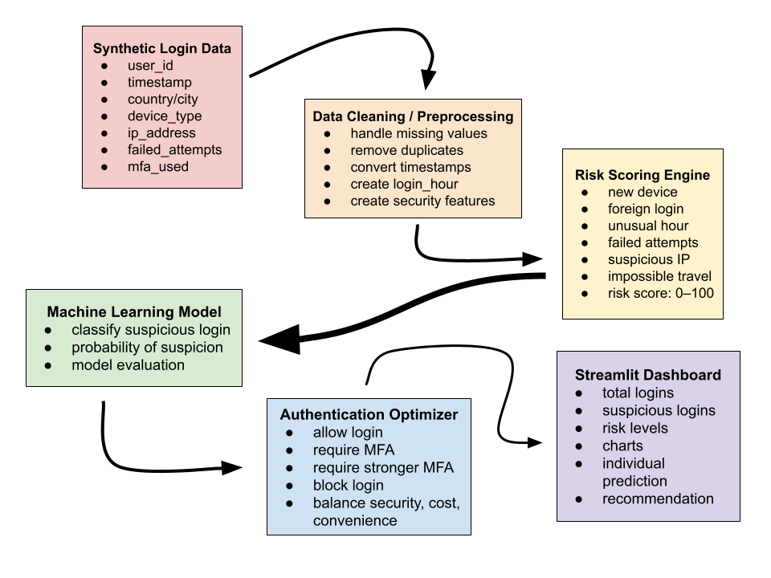

# Smart Security Optimizer

Smart Security Optimizer is an AI-powered cybersecurity project that analyzes login activity, detects suspicious behavior, calculates account risk, and recommends authentication strategies based on security, cost, and user convenience.

## Project Overview

Many organizations struggle to identify whether a login attempt is normal or suspicious. Attackers may use stolen passwords, repeated failed attempts, new devices, foreign locations, suspicious IP addresses, or attempts to bypass multi-factor authentication. At the same time, organizations need to avoid making security so strict that it frustrates normal users.

This project is designed to simulate a risk-based login security system. It will analyze login events, assign each login a risk score, classify the login as Low, Medium, High, or Critical risk, and recommend an appropriate authentication action.

## Intended Users

The intended users of this application are:

* Security teams
* IT administrators
* Organizations monitoring login activity
* Students or researchers studying cybersecurity and AI

## Key Features

* Synthetic login data generation
* Login threat detection
* Rule-based risk scoring engine
* Machine-learning suspicious login classifier
* Authentication recommendation system
* Optimization based on security, cost, and user convenience
* Streamlit dashboard for visualization
* Explainable risk results
* GitHub documentation and project report

## Cybersecurity Threats Checked

The system is designed to check for common login-security threats, including:

* Brute-force attacks
* Credential stuffing
* Impossible travel
* New-device logins
* Unusual login hours
* Suspicious IP addresses
* MFA fatigue or repeated MFA failures
* Multiple failed login attempts
* Foreign or unusual login locations
* Logins without MFA

## System Architecture



The project follows this flow:

```text
Synthetic Login Data
        ↓
Data Cleaning / Preprocessing
        ↓
Risk Scoring Engine
        ↓
Machine Learning Model
        ↓
Authentication Optimizer
        ↓
Streamlit Dashboard
```

## How the System Works

The system begins by generating synthetic login data. Each login event will include information such as user ID, timestamp, country, city, device type, IP address, failed attempts, MFA usage, and login outcome.

The data is then cleaned and processed to create useful security features, such as login hour, new-device status, suspicious IP status, foreign login status, and impossible-travel indicators.

Next, a rule-based risk engine assigns each login a score from 0 to 100. The score is based on risk factors such as failed attempts, no MFA, new device, suspicious IP address, unusual time, or foreign login location.

A machine-learning model will then be trained to classify logins as normal or suspicious. The model will be evaluated using accuracy, precision, recall, F1 score, and a confusion matrix.

Finally, the authentication optimizer recommends the best security response. Possible responses include allowing the login, requiring MFA, requiring stronger MFA, using passwordless authentication, or blocking the login.

## Risk Levels

| Risk Score | Risk Level | Meaning                                 |
| ---------: | ---------- | --------------------------------------- |
|       0–29 | Low        | Login appears normal                    |
|      30–59 | Medium     | Some suspicious signals are present     |
|      60–79 | High       | Strong signs of suspicious behavior     |
|     80–100 | Critical   | Login is highly suspicious or dangerous |

## Authentication Actions

| Risk Level | Recommended Action                                      |
| ---------- | ------------------------------------------------------- |
| Low        | Allow login                                             |
| Medium     | Require MFA                                             |
| High       | Require stronger MFA                                    |
| Critical   | Block login or require additional identity verification |

## Technology Stack

* Python
* Pandas
* NumPy
* Scikit-learn
* Matplotlib
* Plotly
* Streamlit
* Joblib
* Pytest
* GitHub

## Project Structure

```text
Smart-Security-Optimizer/
├── app/
│   └── app.py
├── data/
│   ├── raw/
│   └── processed/
├── docs/
│   ├── project_proposal.md
│   └── threat_model.md
├── images/
│   └── system_architecture.png
├── models/
├── notebooks/
├── src/
│   └── __init__.py
├── tests/
│   └── __init__.py
├── .gitignore
├── LICENSE
├── README.md
└── requirements.txt
```

## Current Project Status

This project is currently in the setup and planning stage.

Completed so far:

* Created GitHub repository
* Added project folder structure
* Added project proposal
* Added threat model documentation
* Added system architecture diagram
* Added initial Python dependency list

Next steps:

* Build the synthetic login data generator
* Create the data dictionary
* Generate the first login dataset
* Build the risk scoring engine
* Train the machine-learning model
* Build the Streamlit dashboard

## Installation

Clone the repository:

```bash
git clone https://github.com/KryptexSNRG/Smart-Security-Optimizer.git
cd Smart-Security-Optimizer
```

Create and activate a virtual environment:

```bash
python -m venv .venv
source .venv/bin/activate
```

Install dependencies:

```bash
pip install -r requirements.txt
```

## Running the Application

The Streamlit dashboard is not fully built yet. Once completed, it will be run with:

```bash
streamlit run app/app.py
```

## Documentation

Additional project documentation is located in the `docs/` folder.

Current documentation includes:

* `project_proposal.md`: Defines the problem, users, scope, dashboard outputs, AI role, and optimization role.
* `threat_model.md`: Explains the cybersecurity threats the system is designed to detect.

## Limitations

This project uses synthetic data and is intended for educational purposes. It is not connected to a real authentication system, real user accounts, or live IP reputation services. The system should not be used as a production cybersecurity tool.

## Future Improvements

Future improvements may include:

* Real-time login monitoring
* User-specific behavior profiles
* Real IP reputation API integration
* Cloud deployment
* Email or Slack alerts for critical-risk logins
* More advanced anomaly detection models
* Database integration

## Author

Atharv Sharma
