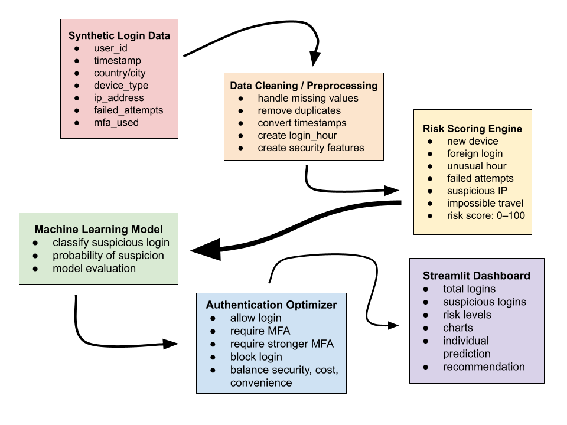

# Smart Security Optimizer

Smart Security Optimizer is an AI-powered cybersecurity project that analyzes login activity, detects suspicious behavior, calculates login risk, and recommends authentication actions based on security, cost, and user convenience.

## Project Overview

Organizations need to protect user accounts from unsafe login activity without making security so strict that it frustrates normal users. Attackers may use stolen passwords, repeated failed attempts, new devices, foreign locations, suspicious IP addresses, or attempts to bypass multi-factor authentication.

This project simulates a login security system that analyzes each login event, calculates a risk score, classifies the login as Low, Medium, High, or Critical risk, and recommends an appropriate security response.

## Intended Users

The intended users of this application are:

- Security teams
- IT administrators
- Organizations monitoring login activity
- Students or researchers studying cybersecurity, AI, and data science

## Key Features

- Synthetic login data generation
- Login threat simulation
- Data validation and preprocessing
- Rule-based risk scoring engine
- Explainable risk reasons
- Risk level classification
- Authentication action recommendations
- Risk analysis charts and summaries
- Unit tests for risk engine behavior
- Future machine-learning suspicious login classifier
- Future authentication optimization system
- Future Streamlit dashboard

## Cybersecurity Threats Checked

The system is designed to check for common login-security threats, including:

- Brute-force attacks
- Credential stuffing
- Impossible travel
- New-device logins
- Unusual login hours
- Suspicious IP addresses
- MFA fatigue or repeated MFA failures
- Multiple failed login attempts
- Foreign or unusual login locations
- Logins without MFA

## System Architecture



The project follows this flow:

```text
Synthetic Login Data
        ↓
Data Cleaning / Preprocessing
        ↓
Risk Scoring Engine
        ↓
Machine Learning Model
        ↓
Authentication Optimizer
        ↓
Streamlit Dashboard
```

## How the System Works

The system begins by generating synthetic login data. Each login event includes information such as user ID, timestamp, country, city, device type, browser, IP address, failed attempts, MFA usage, login success, attack type, and whether the login is suspicious.

The data is then cleaned and processed. During preprocessing, duplicate rows are removed, timestamps are converted, missing values are handled, data types are corrected, and extra security features are created.

Next, a rule-based risk engine assigns each login a score from 0 to 100. The score is based on suspicious signals such as new devices, foreign logins, unusual login hours, failed attempts, no MFA, impossible travel, suspicious IP addresses, MFA fatigue, and successful logins after repeated failures.

The risk engine also returns human-readable explanations for each score so that users can understand why a login was considered risky.

## Synthetic Data

This project uses synthetic login data instead of real user data. Real login data may contain sensitive information such as usernames, locations, IP addresses, device information, and account behavior. Synthetic data allows the project to safely simulate realistic cybersecurity scenarios without exposing private information.

The dataset is generated using:

```text
src/data_generator.py
```

The generated dataset is saved as:

```text
data/raw/login_events.csv
```

The cleaned dataset is saved as:

```text
data/processed/login_events_clean.csv
```

The scored dataset is saved as:

```text
data/processed/login_events_scored.csv
```

## Simulated Attack Types

The synthetic dataset includes several simulated login scenarios:

| Attack Type | Description |
|---|---|
| Normal | Usual country, usual device, normal time, low failed attempts |
| Brute Force | High number of failed login attempts |
| Foreign Login | Login country differs from the user’s usual country |
| Impossible Travel | Login is marked as foreign and physically unrealistic |
| New Device Login | Login comes from a new or different device/browser |
| No MFA Login | MFA is not used |
| Unusual Hour Login | Login occurs between midnight and early morning |
| Suspicious IP Login | Login uses an IP address marked as suspicious |
| Credential Stuffing | Suspicious IP address with multiple failed attempts |
| MFA Fatigue | Multiple MFA failures or repeated MFA attempts |

## Risk Engine Logic

The Smart Security Optimizer uses a point-based risk engine. Each login starts with a score of 0. The system then adds points when suspicious behavior is detected.

The final score is capped at 100, so even if multiple risk factors add up to more than 100, the maximum possible risk score remains 100.

## Risk Scoring Rules

| Risk Factor | Condition | Points |
|---|---|---:|
| New device | `new_device == True` | +30 |
| Foreign login | `foreign_login == True` | +30 |
| Unusual login hour | `unusual_hour == True` | +30 |
| Multiple failed attempts | `failed_attempts >= 3` | +30 |
| High failed attempts | `failed_attempts >= 5` | +40 |
| MFA not used | `mfa_used == False` | +30 |
| Impossible travel | `impossible_travel == True` | +45 |
| Suspicious IP address | `suspicious_ip == True` | +40 |
| MFA fatigue risk | `mfa_failed_attempts >= 3` | +40 |
| Login success after many failures | `failed_attempts >= 5 and login_success == True` | +20 |
| New device without MFA | `new_device == True and mfa_used == False` | +15 |
| Foreign login without MFA | `foreign_login == True and mfa_used == False` | +15 |
| Unusual hour without MFA | `unusual_hour == True and mfa_used == False` | +15 |
| Suspicious IP with failed attempts | `suspicious_ip == True and failed_attempts >= 3` | +15 |

## Risk Categories

| Risk Score | Risk Level | Meaning |
|---:|---|---|
| 0–29 | Low | Login appears normal |
| 30–59 | Medium | Some suspicious signals are present |
| 60–79 | High | Strong signs of suspicious behavior |
| 80–100 | Critical | Login is highly suspicious or dangerous |

## Recommended Actions

| Risk Level | Recommended Action |
|---|---|
| Low | Allow login |
| Medium | Require MFA |
| High | Require stronger MFA |
| Critical | Block login or require additional identity verification |

## Example Risk Calculation

Example login event:

```text
New device: True
Foreign login: True
MFA used: False
Failed attempts: 4
Suspicious IP: False
Impossible travel: False
Unusual hour: False
```

Risk calculation:

```text
New device: +30
Foreign login: +30
MFA not used: +30
Multiple failed attempts: +30
New device without MFA: +15
Foreign login without MFA: +15

Raw score = 150
Final capped score = 100
```

Final result:

```text
Risk Score: 100
Risk Level: Critical
Recommended Action: Block login or require additional identity verification
```

Risk reasons:

```text
Login came from a new device;
Login came from a foreign or unusual country;
Multi-factor authentication was not used;
Login had multiple failed attempts;
New device login did not use MFA;
Foreign login did not use MFA
```

## Data Validation

The project includes a data validation script:

```text
src/data_validation.py
```

This script checks:

- Row count
- Missing values
- Duplicate rows
- Duplicate login IDs
- Valid field ranges
- Normal vs suspicious class distribution
- Attack type distribution

It also creates basic validation charts in the `images/` folder.

## Data Preprocessing

The project includes a preprocessing script:

```text
src/data_preprocessing.py
```

This script:

- Loads the raw dataset
- Removes duplicate rows
- Removes duplicate login IDs
- Converts timestamps
- Recreates login hour and day of week
- Handles missing values
- Fixes data types
- Validates numeric ranges
- Creates additional security features
- Saves a cleaned dataset

## Risk Analysis

The project includes a risk analysis script:

```text
src/risk_analysis.py
```

This script analyzes:

- Overall risk score distribution
- Average risk score by attack type
- Risk level counts
- Common risk factors
- Suspicious logins that are scored too low
- Attack type vs risk level results

The analysis outputs are saved in the `images/` and `data/processed/` folders.

## Unit Tests

The project includes unit tests for the risk engine:

```text
tests/test_risk_engine.py
```

The tests check:

- Normal login scoring
- New-device login scoring
- Foreign login scoring
- Brute-force login scoring
- No-MFA login scoring
- Impossible-travel scoring
- Suspicious-IP scoring
- MFA-fatigue scoring
- Score cap at 100
- Risk level boundaries
- Recommended action mapping

To run the tests:

```bash
pytest
```

## Technology Stack

- Python
- Pandas
- NumPy
- Scikit-learn
- Matplotlib
- Plotly
- Streamlit
- Joblib
- Pytest
- GitHub

## Project Structure

```text
Smart-Security-Optimizer/
├── app/
│   └── app.py
├── data/
│   ├── raw/
│   │   └── login_events.csv
│   └── processed/
│       ├── login_events_clean.csv
│       ├── login_events_scored.csv
│       ├── attack_type_risk_summary.csv
│       ├── common_risk_factors.csv
│       ├── low_scored_suspicious_logins.csv
│       └── attack_type_risk_level_table.csv
├── docs/
│   ├── project_proposal.md
│   ├── threat_model.md
│   ├── data_dictionary.md
│   ├── synthetic_data_methodology.md
│   └── risk_scoring_methodology.md
├── images/
│   ├── system_architecture.png
│   ├── normal_vs_suspicious.png
│   ├── attack_type_distribution.png
│   ├── failed_attempts_distribution.png
│   ├── login_hour_distribution.png
│   ├── risk_level_distribution.png
│   ├── average_risk_by_attack_type.png
│   ├── common_risk_factors.png
│   └── risk_score_histogram.png
├── models/
├── notebooks/
├── src/
│   ├── __init__.py
│   ├── data_generator.py
│   ├── data_validation.py
│   ├── data_preprocessing.py
│   ├── risk_engine.py
│   └── risk_analysis.py
├── tests/
│   ├── __init__.py
│   └── test_risk_engine.py
├── .gitignore
├── LICENSE
├── README.md
└── requirements.txt
```

## Installation

Clone the repository:

```bash
git clone https://github.com/KryptexSNRG/Smart-Security-Optimizer.git
cd Smart-Security-Optimizer
```

Create and activate a virtual environment:

```bash
python -m venv .venv
source .venv/bin/activate
```

Install dependencies:

```bash
pip install -r requirements.txt
```

## Running the Project

Generate the synthetic dataset:

```bash
python src/data_generator.py
```

Validate the dataset:

```bash
python src/data_validation.py
```

Preprocess the dataset:

```bash
python src/data_preprocessing.py
```

Apply the risk engine:

```bash
python src/risk_engine.py
```

Analyze risk scoring results:

```bash
python src/risk_analysis.py
```

Run unit tests:

```bash
pytest
```

## Running the Dashboard

The Streamlit dashboard is not fully built yet. Once completed, it will be run with:

```bash
streamlit run app/app.py
```

## Documentation

Additional project documentation is located in the `docs/` folder.

Current documentation includes:

- `project_proposal.md`: Defines the problem, users, scope, dashboard outputs, AI role, and optimization role.
- `threat_model.md`: Explains the cybersecurity threats the system is designed to detect.
- `data_dictionary.md`: Defines the login-event schema and variable types.
- `synthetic_data_methodology.md`: Explains how the synthetic dataset was generated, why synthetic data was used, and its limitations.
- `risk_scoring_methodology.md`: Defines the point-based risk rules, score cap, risk levels, and recommended actions.

## Current Project Status

Completed so far:

- Created GitHub repository
- Added project folder structure
- Added project proposal
- Added threat model documentation
- Added data dictionary
- Added synthetic data methodology
- Added system architecture diagram
- Built synthetic login data generator
- Generated 10,000 login records
- Validated dataset quality
- Built preprocessing pipeline
- Created cleaned dataset
- Built rule-based risk scoring engine
- Added risk levels and recommended actions
- Added explainable risk reasons
- Applied risk scoring to every login event
- Added risk analysis outputs and charts
- Added unit tests for the risk engine

Next steps:

- Select machine-learning features
- Build feature engineering pipeline
- Train baseline machine-learning models
- Evaluate model performance
- Build authentication optimizer
- Build Streamlit dashboard
- Add final project report and demo video

## Limitations

This project uses synthetic data and is intended for educational purposes. It is not connected to a real authentication system, real user accounts, or live IP reputation services.

Some attack labels are scenario-based, meaning the data generator intentionally creates a threat type and modifies related fields to match that scenario. Future versions can improve the dataset by calculating more indicators directly from user history, timestamps, locations, and device behavior.

This project should not be used as a production cybersecurity system.

## Future Improvements

Future improvements may include:

- Real-time login monitoring
- User-specific behavior profiles
- Real IP reputation API integration
- Geographic distance calculations for impossible travel
- Cloud deployment
- Email or Slack alerts for critical-risk logins
- More advanced anomaly detection models
- Database integration
- Full Streamlit dashboard
- Authentication optimization engine
- Final technical report and demo video

## Author

Atharv Sharma
